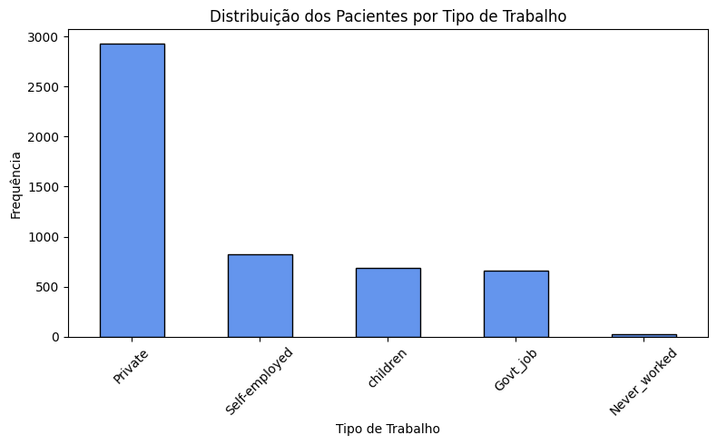
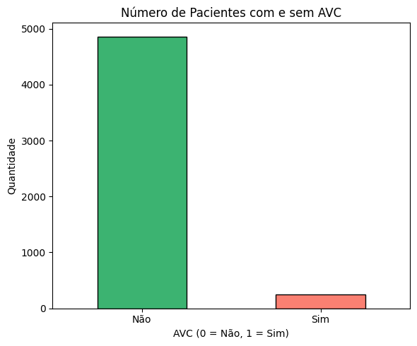
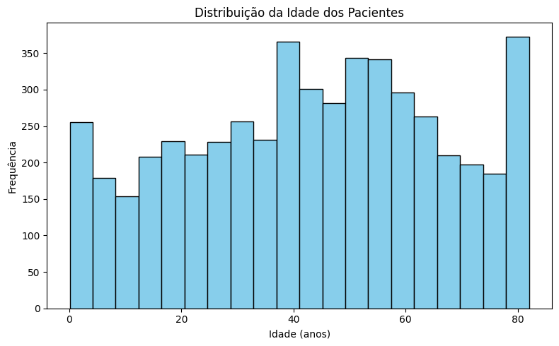
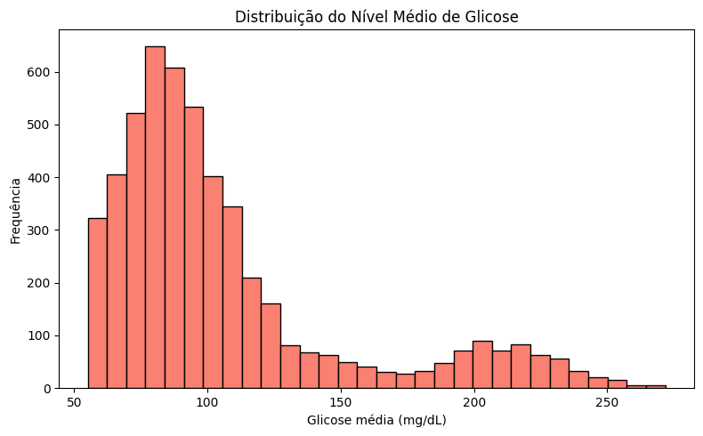
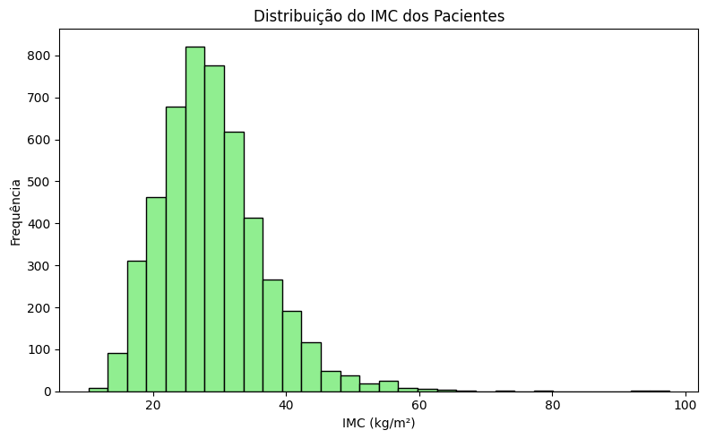
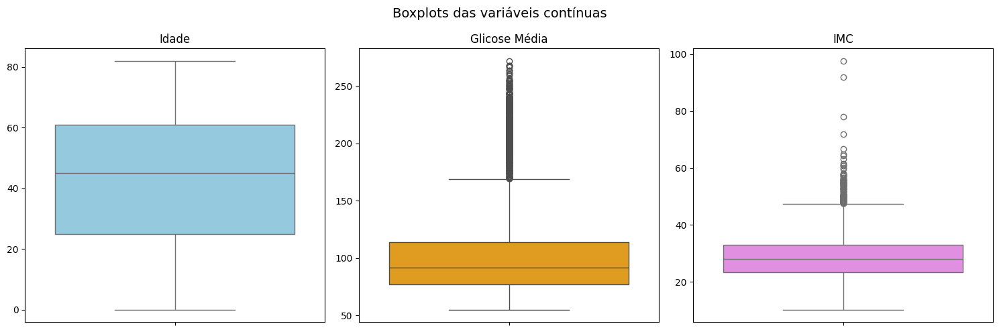
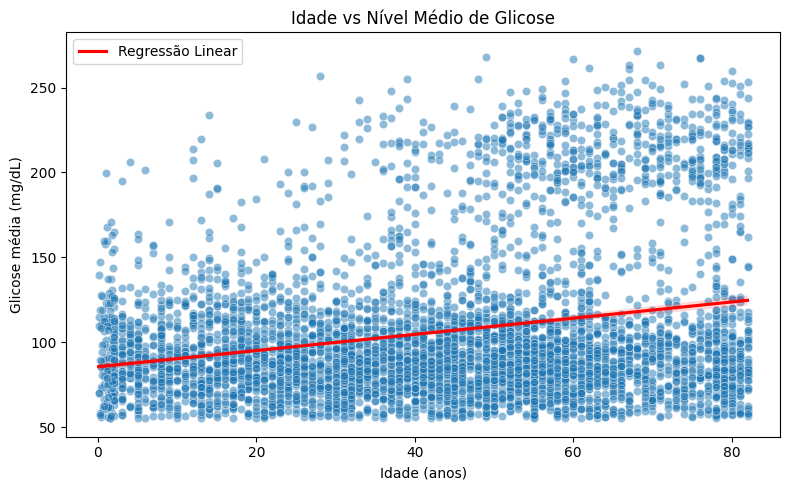

# Análise Descritiva e Regressão Linear - Fatores de Risco de AVC

O Acidente Vascular Cerebral (AVC) é uma das principais causas de mortalidade e incapacitação no mundo. Diversos estudos apontam fatores de risco bem estabelecidos para o AVC, incluindo hipertensão arterial, diabetes, doenças cardíacas, tabagismo e idade avançada.

Por exemplo, estima-se que cerca de 70% dos pacientes que sofrem AVC apresentavam hipertensão, e o AVC chega a ser quatro vezes mais comum em indivíduos diabéticos em comparação à população geral. Além disso, o hábito de fumar aumenta significativamente a probabilidade de AVC, e o risco de derrame dobra a cada década após os 55 anos de idade.

Conhecer o perfil desses fatores de risco na população pode ajudar na prevenção e no desenvolvimento de políticas de saúde. Neste trabalho, analisaremos um dataset público de pacientes que reúne informações demográficas e de saúde relacionadas a esses fatores de risco, bem como a ocorrência (ou não) de AVC para cada paciente. Este conjunto de dados foi obtido no contexto de uma competição do Kaggle e contém diversas variáveis relevantes para prever a chance de AVC a partir dos fatores mencionados.

Cada linha do dataset representa um paciente, incluindo se ele teve AVC (stroke = 1 para sim, 0 para não) e as seguintes características:

* **gender**: gênero biológico do paciente (Male, Female ou Other);
* **age**: idade do paciente (em anos);
* **hypertension**: histórico de hipertensão (1 = sim, 0 = não);
* **heart_disease**: presença de doença cardíaca (1 = sim, 0 = não);
* **ever_married**: estado civil (se o paciente já foi casado – Yes ou No);
* **work_type**: tipo de trabalho (Private = setor privado, Self-employed = autônomo, Govt_job = servidor público, children = crianças, Never_worked = nunca trabalhou);
* **Residence_type**: tipo de residência (Urban = urbana, Rural = rural);
* **avg_glucose_level**: nível médio de glicose no sangue do paciente (mg/dL);
* **bmi**: Índice de Massa Corporal do paciente (kg/m²);
* **smoking_status**: status de tabagismo (never smoked = nunca fumou, formerly smoked = ex-fumante, smokes = fumante, ou Unknown = desconhecido).

O conjunto de dados possui **5.110 observações** (pacientes) e 12 variáveis. A seguir, faremos a leitura do dataset e conduziremos uma análise estatística descritiva, explorando as variáveis. Em seguida, calcularemos a correlação entre idade e nível de glicose e ajustaremos um modelo de regressão linear simples para investigar a relação entre eles.

# Leitura dos dados

Vamos iniciar carregando o dataset CSV em um DataFrame pandas.

```python
import matplotlib.pyplot as plt
import seaborn as sns
import kagglehub
from kagglehub import KaggleDatasetAdapter
import pandas as pd
```

```python
# Caminho do arquivo dentro do dataset
file_path = "healthcare-dataset-stroke-data.csv"

# Carregar o dataset diretamente do Kaggle como DataFrame pandas
df = kagglehub.load_dataset(
    KaggleDatasetAdapter.PANDAS,
    "fedesoriano/stroke-prediction-dataset",
    file_path,
)

# Visualizar as primeiras linhas
print("Dimensões do dataset:", df.shape)
df.head()
```

> Dimensões do dataset: (5110, 12)

| | id | gender | age | hypertension | heart_disease | ever_married | work_type | Residence_type | avg_glucose_level | bmi | smoking_status | stroke |
|---|---|---|---|---|---|---|---|---|---|---|---|---|
| **0** | 9046 | Male | 67.0 | 0 | 1 | Yes | Private | Urban | 228.69 | 36.6 | formerly smoked | 1 |
| **1** | 51676 | Female | 61.0 | 0 | 0 | Yes | Self-employed | Rural | 202.21 | NaN | never smoked | 1 |
| **2** | 31112 | Male | 80.0 | 0 | 1 | Yes | Private | Rural | 105.92 | 32.5 | never smoked | 1 |
| **3** | 60182 | Female | 49.0 | 0 | 0 | Yes | Private | Urban | 171.23 | 34.4 | smokes | 1 |
| **4** | 1665 | Female | 79.0 | 1 | 0 | Yes | Self-employed | Rural | 174.12 | 24.0 | never smoked | 1 |

Como podemos ver, o dataset contém 5.110 registros e 12 colunas. Observe que valores ausentes são representados como N/A em algumas colunas (por exemplo, `bmi`). Vamos verificar quantos valores faltantes existem em cada variável:

```python
# Verificar valores ausentes em cada coluna
print(df.isna().sum())
```

```
id                     0
gender                 0
age                    0
hypertension           0
heart_disease          0
ever_married           0
work_type              0
Residence_type         0
avg_glucose_level      0
bmi                  201
smoking_status         0
stroke                 0
dtype: int64
```

No resultado acima, notamos que a variável `bmi` possui 201 valores ausentes. Para fins da análise descritiva, iremos ignorar esses valores (os métodos estatísticos do pandas já fazem essa exclusão automaticamente).

# Análise Descritiva – Variáveis Qualitativas e Quantitativas Discretas

Começamos explorando as variáveis categóricas e as variáveis quantitativas discretas (indicadores 0/1). As principais são:
* Gênero (`gender`),
* Já foi casado (`ever_married`),
* Tipo de trabalho (`work_type`),
* Tipo de residência (`Residence_type`),
* Status de tabagismo (`smoking_status`),
* Hipertensão (`hypertension`, 0/1),
* Doença cardíaca (`heart_disease`, 0/1),
* AVC (`stroke`, 0/1, variável de desfecho).

### Distribuições de frequência

```python
# Tabelas de frequência para variáveis categóricas e discretas
print("Distribuição por gênero:\n", df['gender'].value_counts(), "\n")
print("Estado civil (ever_married):\n", df['ever_married'].value_counts(), "\n")
print("Tipo de residência:\n", df['Residence_type'].value_counts(), "\n")
print("Hipertensão:\n", df['hypertension'].value_counts(), "\n")
print("Doença cardíaca:\n", df['heart_disease'].value_counts(), "\n")
print("AVC (0=Não, 1=Sim):\n", df['stroke'].value_counts(), "\n")
```

**Tabela 1: Distribuição de frequências** – Observando as saídas, podemos destacar:
* **Gênero**: A maioria dos pacientes são do sexo feminino (58,6%).
* **Estado civil**: Aproximadamente 65,6% dos pacientes já foram casados.
* **Tipo de residência**: A população está quase dividida entre áreas urbanas (50,8%) e rurais (49,2%).
* **Hipertensão**: Cerca de 9,7% dos pacientes têm histórico de hipertensão.
* **Doença cardíaca**: Apenas 5,4% apresentam doença cardíaca.
* **AVC**: Somente 249 pacientes (4,9%) tiveram AVC. Este dado evidencia que o desfecho é relativamente raro no dataset.

### Visualização de variáveis categóricas

```python
plt.figure(figsize=(8,5))
df['work_type'].value_counts().plot(kind='bar', color='cornflowerblue', edgecolor='black')
plt.title('Distribuição dos Pacientes por Tipo de Trabalho')
plt.xlabel('Tipo de Trabalho')
plt.ylabel('Frequência')
plt.xticks(rotation=45)
plt.tight_layout()
plt.show()
```



*Figura 1: Distribuição dos pacientes por tipo de trabalho.*

Observa-se que a maioria (57,2%) trabalha no setor privado. Outro aspecto relevante é a proporção de pacientes que efetivamente sofreram AVC.

```python
plt.figure(figsize=(6,5))
df['stroke'].value_counts().sort_index().plot(kind='bar', color=['mediumseagreen', 'salmon'], edgecolor='black')
plt.title('Número de Pacientes com e sem AVC')
plt.xlabel('AVC (0 = Não, 1 = Sim)')
plt.ylabel('Quantidade')
plt.xticks([0,1], ['Não', 'Sim'], rotation=0)
plt.tight_layout()
plt.show()
```



*Figura 2: Comparação do número de pacientes que tiveram AVC (sim) versus que não tiveram (não).*

A disparidade é evidente, com o grupo "Não" muito mais numeroso.

# Análise Descritiva – Variáveis Quantitativas Contínuas

Passamos agora às variáveis quantitativas contínuas: idade (`age`), nível médio de glicose (`avg_glucose_level`) e IMC (`bmi`).

```python
# Medidas descritivas das variáveis contínuas
print(df[['age','avg_glucose_level','bmi']].describe())
```

**Tabela 2: Medidas descritivas (idade, glicose média, IMC)**

| Variável | N | Média | Desvio Padrão | Mínimo | Q1 | Mediana | Q3 | Máximo |
| :--- | :--- | ---: | ---: | ---: | ---: | ---: | ---: | ---: |
| **Idade (anos)** | 5110 | 43,23 | 22,61 | 0,08 | 25,0 | 45,0 | 61,0 | 82,0 |
| **Glicose (mg/dL)** | 5110 | 106,15 | 45,28 | 55,12 | 77,25 | 91,89 | 114,09 | 271,74 |
| **IMC (kg/m²)** | 4909 | 28,89 | 7,85 | 10,30 | 23,50 | 28,10 | 33,10 | 97,60 |

*Observação: O IMC tem 4909 casos válidos pois 201 estão ausentes (N/A).*

### Histogramas e Boxplots

```python
plt.figure(figsize=(8,5))
plt.hist(df['age'], bins=20, color='skyblue', edgecolor='black')
plt.title('Distribuição da Idade dos Pacientes')
plt.xlabel('Idade (anos)')
plt.ylabel('Frequência')
plt.tight_layout()
plt.show()
```



*Figura 3: Histograma da idade dos pacientes.*

```python
plt.figure(figsize=(8,5))
plt.hist(df['avg_glucose_level'], bins=30, color='salmon', edgecolor='black')
plt.title('Distribuição do Nível Médio de Glicose')
plt.xlabel('Glicose média (mg/dL)')
plt.ylabel('Frequência')
plt.tight_layout()
plt.show()
```



*Figura 4: Histograma do nível médio de glicose. A distribuição é assimétrica à direita.*

```python
plt.figure(figsize=(8,5))
plt.hist(df['bmi'].dropna(), bins=30, color='lightgreen', edgecolor='black')
plt.title('Distribuição do IMC dos Pacientes')
plt.xlabel('IMC (kg/m²)')
plt.ylabel('Frequência')
plt.tight_layout()
plt.show()
```



*Figura 5: Histograma do IMC dos pacientes.*

```python
plt.figure(figsize=(15,5))
# Boxplot da Idade
plt.subplot(1, 3, 1)
sns.boxplot(y=df['age'], color='skyblue')
plt.title('Idade')
# ... e assim por diante para os outros plots
plt.suptitle('Boxplots das variáveis contínuas', fontsize=14)
plt.tight_layout()
plt.show()
```



Figura 6: Boxplots de Idade, Glicose Média e IMC. Cada boxplot mostra mediana (linha central), quartis (caixa) e possíveis outliers (pontos individuais fora dos whiskers).

Analisando os boxplots:

* Idade: mediana ~45 anos, Q1 ~25 e Q3 ~61. A amplitude interquartil é 36 anos, e não vemos outliers significativos (os whiskers praticamente vão do mínimo ao máximo, indicando uma distribuição longa mas sem valores aberrantes fora de 1.5x IQR). Idades jovens (próximas de 0) e a máxima 82 estão dentro do intervalo esperado (não marcados como outlier pelo critério do boxplot).
* Glicose: mediana ~92 mg/dL, Q3 ~114 e Q1 ~77. Aqui notamos vários outliers acima: os pontos indicam pacientes com glicose bem acima do limite superior do whisker. De fato, pelo critério 1.5xIQR, valores acima de ~155 mg/dL já seriam marcados como outliers – confirmando que há muitos pacientes com glicose elevada fora desse intervalo (reforçando a cauda longa direita observada).
* IMC: mediana ~28, Q3 ~33, Q1 ~23,5. Existem outliers superiores bem evidentes (pontos acima de ~47-50 de IMC), correspondendo aos casos de obesidade severa (até 97,6). Não há outliers inferiores extremos (IMC mínimo ~10 ainda está um pouco acima do limiar de outlier pelo IQR).
Em resumo, do ponto de vista descritivo, os pacientes do dataset em média têm meia-idade, com glicemia tendendo a ser alta (muitos acima do normal) e IMC médio correspondendo a sobrepeso. Isso sugere uma população de risco considerável: idade avançando, sobrepeso/obesidade e predisposição a diabetes – combinação que está alinhada com os fatores que elevam o risco de AVC na literatura médica

# Correlação entre Idade e Nível de Glicose

Dentre as variáveis quantitativas, é relevante investigar a relação entre idade e nível médio de glicose no sangue. Sabemos que ambas tendem a aumentar o risco de AVC individualmente (idade avançada e diabetes/glicemia alta são fatores de risco independentes). Aqui, examinamos se pacientes mais velhos tendem a apresentar glicose média mais elevada (possivelmente indicando maior prevalência de pré-diabetes/diabetes com a idade). Para quantificar isso, calculamos o coeficiente de correlação de Pearson entre idade e glicose:

```python
import numpy as np
# Calcular a correlação de Pearson entre idade e nível médio de glicose
corr = df['age'].corr(df['avg_glucose_level'])
print(f"Correlação de Pearson (idade vs glicose média) = {corr:.3f}")
```
> Correlação de Pearson (idade vs glicose média) = 0.238

O valor obtido foi aproximadamente 0,238. Ou seja, há uma correlação positiva fraca entre idade e nível de glicose. Esse coeficiente indica que, no geral, pacientes mais velhos tendem a ter glicemia média ligeiramente mais alta, mas a relação não é muito forte (o coeficiente vai de -1 a 1, então 0,238 representa uma associação positiva de baixa intensidade). Podemos também verificar a significância estatística dessa correlação. Com 5110 observações, mesmo uma correlação fraca tende a ser significativa. De fato, o teste de Pearson para  H0:ᵨ=0  retorna um p-valor praticamente zero (muito menor que 0,001), indicando que essa correlação é estatisticamente diferente de 0. Entretanto, do ponto de vista prático, o coeficiente em torno de 0,24 sugere que a idade explica apenas cerca de $0,238^2 \approx 5,7\%$ da variação nos níveis de glicose. Muitos outros fatores além da idade influenciam a glicemia (por exemplo, genética, dieta, atividade física, uso de medicamentos etc.).

# Regressão Linear Simples (Glicose ~ Idade)

Embora a correlação não seja forte, podemos modelar a relação entre idade e glicose por meio de uma reta de regressão linear simples. Isso nos permite estimar, em média, quanto aumenta o nível médio de glicose a cada ano adicional de idade. Vamos tomar idade como variável explicativa (X) e glicose média como variável resposta (Y) em um modelo linear $Y = \beta_0 + \beta_1 X$,  Ajustaremos o modelo e obteremos os coeficientes:

```python
from sklearn.linear_model import LinearRegression

X = df[['age']].values
y = df['avg_glucose_level'].values

model = LinearRegression()
model.fit(X, y)

beta0 = model.intercept_
beta1 = model.coef_[0]
r2 = model.score(X, y)

print(f"Intercepto (beta0) = {beta0:.2f}")
print(f"Inclinação (beta1) = {beta1:.3f}")
print(f"R² do modelo = {r2:.3f}")
```

> Intercepto (beta0) = 85.53
> Inclinação (beta1) = 0.477
> R² do modelo = 0.057

A equação de regressão ajustada é:
$Glicose\ Média\ Estimada = 85,53 + 0,477 \times Idade$.

Em outras palavras, o modelo sugere que, a cada ano a mais de idade, o nível médio de glicose do paciente aumenta em torno de 0,477 mg/dL, em média. Assim, por exemplo, uma pessoa 10 anos mais velha teria cerca de 4,8 mg/dL a mais de glicose média prevista, em comparação a uma mais jovem (mantidos outros fatores constantes). O intercepto 85,53 indica a glicemia média estimada para um paciente de 0 anos (obviamente extrapolado fora do alcance real, mas matematicamente é o ponto onde a reta cruza o eixo de glicose).

O valor de  R2≈0,057  confirma que a idade explica somente 5,7% da variação total da glicose – coerente com a correlação fraca observada. Isso significa que há grande dispersão dos pontos em torno da reta, ou seja, indivíduos da mesma idade podem ter glicoses muito diferentes. Ainda assim, a inclinação positiva reflete a tendência geral de maior glicemia em idades mais avançadas, o que faz sentido (maior prevalência de diabetes em pessoas idosas cdc.gov ). A figura a seguir mostra o gráfico de dispersão dos dados de idade vs. glicose, juntamente com a reta de regressão ajustada em vermelho:
```python
plt.figure(figsize=(8,5))
sns.scatterplot(x='age', y='avg_glucose_level', data=df, alpha=0.5)
sns.regplot(x='age', y='avg_glucose_level', data=df, scatter=False, color='red', label='Regressão Linear')
plt.title('Idade vs Nível Médio de Glicose')
plt.xlabel('Idade (anos)')
plt.ylabel('Glicose média (mg/dL)')
plt.legend()
plt.tight_layout()
plt.show()
```



*Figura 7: Diagrama de dispersão com a linha de regressão, mostrando a leve tendência positiva.*

Visualmente, podemos confirmar que os pontos estão bem espalhados e a linha de tendência tem uma subida lenta. Observando o gráfico, por exemplo, pacientes em torno de 80 anos apresentam glicoses desde ~70 até ~250 mg/dL – ou seja, a idade por si só não determina a glicemia, mas existe uma leve tendência ascendente. Em termos práticos: pacientes mais velhos têm mais chance de serem diabéticos ou pré-diabéticos, o que eleva sua glicemia média. No entanto, muitos idosos ainda mantêm glicose normal, e muitos jovens já têm glicose alta, de forma que a correlação não é alta. Fatores como dieta, genética e presença de condições como obesidade desempenham papéis importantes na glicose independente da idade.

# Conclusões

* A maioria dos pacientes da amostra é do sexo feminino e de meia-idade. Apenas ~5% efetivamente sofreram AVC, refletindo a baixa incidência do evento no conjunto.
* Entre os fatores de risco categóricos, destacam-se a proporção de hipertensos (9,7%) e diabéticos potenciais (~19% com glicose muito alta). A maioria dos pacientes (64%) está acima do peso ideal (sobrepeso/obesidade), o que agrava outros riscos.
* As distribuições das variáveis contínuas mostram: Idade: amplitude grande (0 a 82 anos) com mediana de 45 anos; distribuição levemente assimétrica à esquerda. Glicose média: média ~106 mg/dL, mediana ~92 mg/dL, distribuição bastante assimétrica à direita com muitos outliers altos (indicando parcela de pacientes diabéticos).
* IMC: média ~28,9 kg/m² (sobrepeso), mediana ~28,1, distribuição assimétrica à direita com vários casos de obesidade severa.
* A análise de correlação revelou uma associação positiva porém fraca entre idade e glicemia. A regressão linear quantificou essa relação: ~0,48 mg/dL a mais de glicose por ano de idade, embora explicando apenas 5,7% da variabilidade total (R²=0,057).

Esses resultados refletem que, dentro deste conjunto de pacientes, o perfil de risco de AVC inclui frequentemente excesso de peso, glicose elevada e idade avançada – fatores que, combinados, aumentam substancialmente o risco de um evento cerebrovascular. A presença de hipertensão em ~10% e de tabagismo ativo em ~15% complementa esse cenário de risco. Tais achados estão alinhados com o conhecimento médico: sabe-se que controlar a pressão alta, a glicemia e o peso, além de evitar fumar, são medidas essenciais na prevenção do AVC.

Portanto, a análise descritiva confirma a importância desses fatores na amostra e prepara o terreno para estudos posteriores, como modelos preditivos de AVC ou análises multivariadas para quantificar a influência relativa de cada fator de risco.
